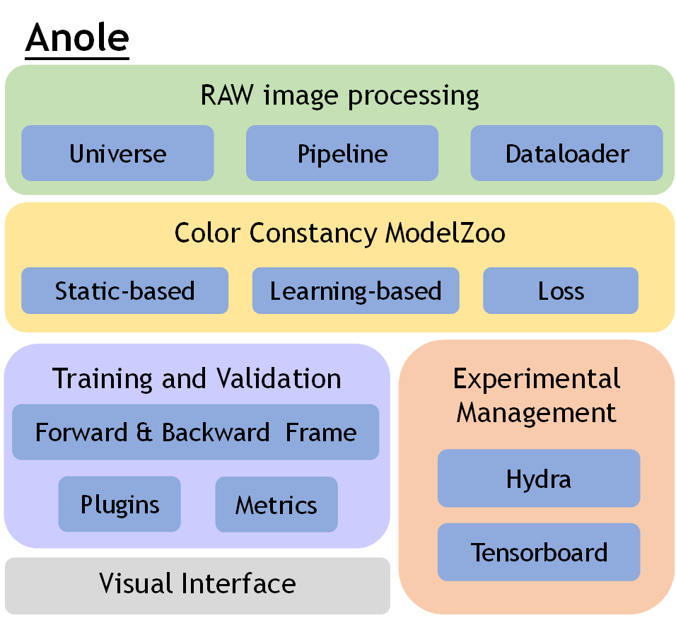

# Anole

An End-to-End Code Library and Public Platform for Color Constancy 

Color constancy is a technology closely related to image color quality, which is dedicated to making cameras record real colors of the whole world. In order to promote the development of color constancy, we are committed to open source the first color constancy code library and designing a lightweight, easy-to-use, and easy-to-expand platform, which can:

- Reproduce SOTA results quickly, 
- Provide a fair evaluation framework,
- Provide mature cutting-edge model and color constancy toolchains.

The library is organized into four main modules:

- RAW Image Processing [[anole/raw_processing](https://github.com/YuxiangTang/Anole/tree/master/anole/raw_processing)]: Mainly includes all kinds of RAW image pre-and post-processing functions, such as black/white level correction, de-mosaic, color space conversion, gamma correction, tone curve correction, etc. These functions have strong versatility in RAW image processing and are also the important processing nodes in the camera pipeline.
- Color Constancy Modelzoo [[anole/model](https://github.com/YuxiangTang/Anole/tree/master/anole/model)]: Deep-learning research has a core obstacle --"baseline is difficult to reproduce". Therefore, a long-term goal of this code library is to unify the popular and commonly used baseline under one set of frameworks, and to provide a quick and less code way to build and reproduce the model on various ends. 
- Unified Evaluation Framework [[anole/training](https://github.com/YuxiangTang/Anole/tree/master/anole/training)]: It is difficult for people without camera processing experience to get started with color constancy, and some specifications are not accurately transmitted to various researchers, which leads to irregular use of data sets and inconsistent evaluation standards. To solve this problem, this code library  provides a unified testing framework and system, so as to standardize and unify the indicators of each dataset.
- Experimental Management [[./config](https://github.com/YuxiangTang/Anole/tree/master/config)]: In this code library, you can manage the experiment by generating a report over Hydra and visualization technology after each experiment.



## Getting Started

### Setup Environment

```bash
% optional
conda create -n anole python=3.7
conda activate anole
% necessary
pip install -r requirements.txt
```

### Prepare the dataset

##### ==> Option One: Download the source data and pre-process it locally.

**Step1:** Download the source data and organize files as required

You need to create the initial folder as follows, and then put the corresponding datasets one by one.

```
data
└── source
    ├── colorchecker2010
    ├── Cube
    └── NUS
```

------

***Dataset1: [ColorChecker (Reporcessed)](https://www2.cs.sfu.ca/~colour/data/shi_gehler/)***

Download the **PNG Images** and **Measured illumination** first. After decompression, the files are organized as follows:

```bash
├── IMG_0901.png
├── IMG_0902.png
├── coordinates
│   ├── IMG_0901_macbeth.txt
│   └── IMG_0902_macbeth.txt
├── img.txt
└── real_illum_568..mat
```

**img.txt**：include all image names.

------

***Dataset2: [NUS-8](https://cvil.eecs.yorku.ca/projects/public_html/illuminant/illuminant.html)***

Download **PNG files (ZIP1, ZIP2, ...)**, **MASK**, **GROUNDTRUTH** from eight camera. After decompression, the files are organized as follows:

```
├── Canon1DsMkIII
│   ├── CHECKER
│   │   ├── Canon1DsMkIII_0001_color.txt
│   │   ├── Canon1DsMkIII_0001_mask.txt
│   │   ├── Canon1DsMkIII_0002_color.txt
│   │   └── Canon1DsMkIII_0002_mask.txt
│   ├── Canon1DsMkIII_0001.PNG
│   ├── Canon1DsMkIII_0002.PNG
│   └── Canon1DsMkIII_gt.mat
├── Canon600D
│   ├── CHECKER
│   │   ├── Canon600D_0001_color.txt
│   │   ├── Canon600D_0001_mask.txt
│   │   ├── Canon600D_0002_color.txt
│   │   └── Canon600D_0002_mask.txt
│   ├── Canon600D_0001.PNG
│   ├── Canon600D_0002.PNG
│   ├── Canon600D_CHECKER.zip
│   └── Canon600D_gt.mat
├── FujifilmXM1
...
├── NikonD5200
...
├── OlympusEPL6
...
├── PanasonicGX1
...
├── SamsungNX2000
...
└── SonyA57
```

------

***Dataset3: [Cube/Cube+](https://ipg.fer.hr/ipg/resources/color_constancy)***

Download **PNG files (PNG_1_200.zip, ...)**, **cube+_gt.txt**. After decompression, the files are organized as follows:

```
├── 1.PNG
├── 10.PNG
├── cube+_gt.txt
└── img.txt
```

**img.txt**：include all image names.

------

**Step2:** Pre-process data locally

```bash
python data_preprocess.py --output_dir ./data/processed/ --input_dir ./data/source/ --resize2half False
```

**output_dir**: the path save the processed files (image, illumination, camera_type, mask).

**input_dir**: the path save the source files, as above.

**resize2half**: For speed up training, reduce the length and width of the preprocessed file to half.

##### ==> Option Two: Download the pre-processed data.

The url is: 


## Quick Example

- run FC4 by the following script:

```bash
python launch.py --cfg FC4_confidence.yaml
```

The classic FC4 adopts SqueezeNet but still cannot achieve the purpose of industrialization. In Anole, you can get a smaller model by easily replacing the backbone. The following example shows how to change the backbone to MobileNet:

```yaml
model:
  name: base_pipeline
  params:
    pretrained: 'path'

  backbone:
    name: mobilenetv3_small # here is change
    params:
      pretrained: True

  neck: 
    name: fully_conv_neck
    params:
      input_channels: 512
      output_channels: 64

  head:
    name: confidence_pooling_head
    params:
      input_channels: 64
```

Any part can be changed in yaml and all implemented modules can be seen in [anole/model](https://github.com/YuxiangTang/Anole/tree/master/anole/model). 

> The use of Anole is similar to [MMCV](https://github.com/open-mmlab/mmcv). The module is called and extended by Registry, and the model and training strategy are built by parsing "config/*. yaml" file in [launch.py](https://github.com/YuxiangTang/Anole/blob/tangyuxiang_dev/anole/launch.py) file.

## Extending Anole

> Custom by yourself

We divide the model structure into four categories: 

- Backbone: Used to extract features, it is generally composed of convolution parts of classical models, such as SqueezeNet, AlexNet, etc.
- Neck: Used for feature processing to enhance the expression ability of networks, such as channel re-weighting module in MDLCC, 
- Head: Used to strategically output prediction, such as confidence-weighted pooling in FC4
- Pipeline: Assemble the above four categories of modules. Most models can share a pipeline, such as (FC4, MDLCC), (CLCC, IGTN), (SIIE, TLCC). 

You can focus on customizing a particular category, and we give an [example](https://github.com/YuxiangTang/Anole/blob/master/anole/model/neck/identity_neck.py) for a custom neck in the following:

```python
import torch.nn as nn

from ..builder import NECK  # Need to import the registry.

__all__ = ['identity_neck']

# Custom by yourself
class IdentityNeck(nn.Module):
    def __init__(self, **kwargs):
        super(IdentityNeck, self).__init__()

    def forward(self, x, **kwargs):
        return x

# Need to register first and you can call it in the config.
@NECK.register_obj
def identity_neck(**kwargs):
    return IdentityNeck(**kwargs)

```

## Some Results

